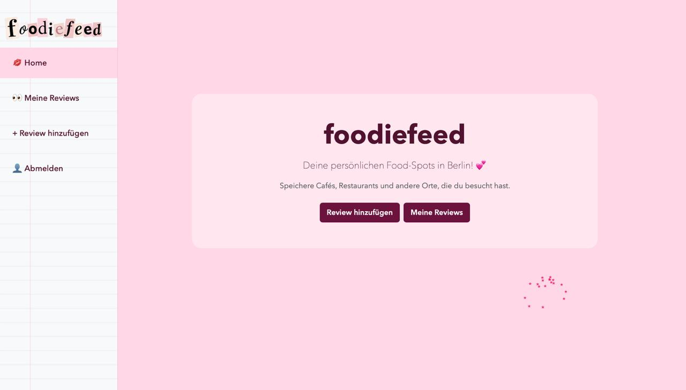
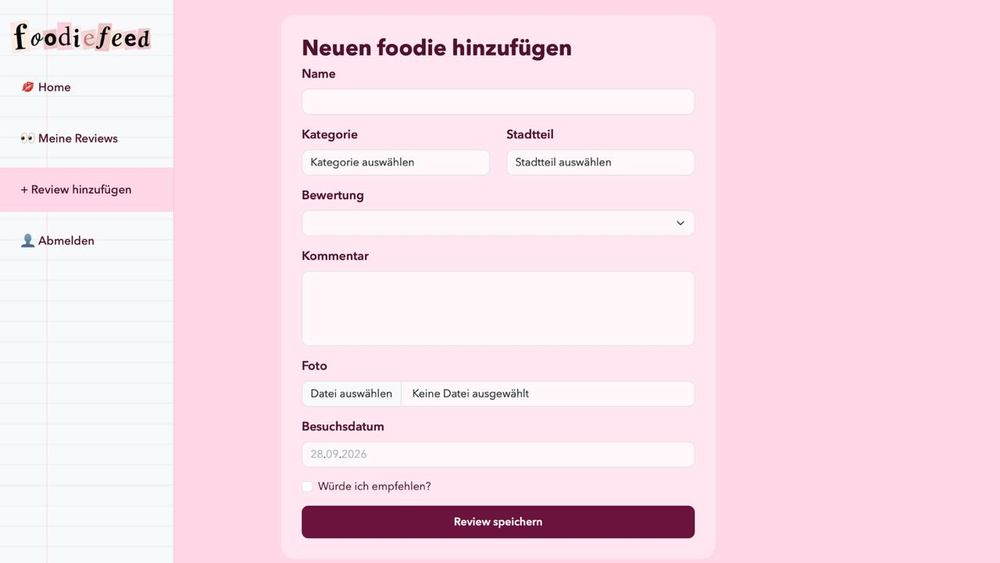
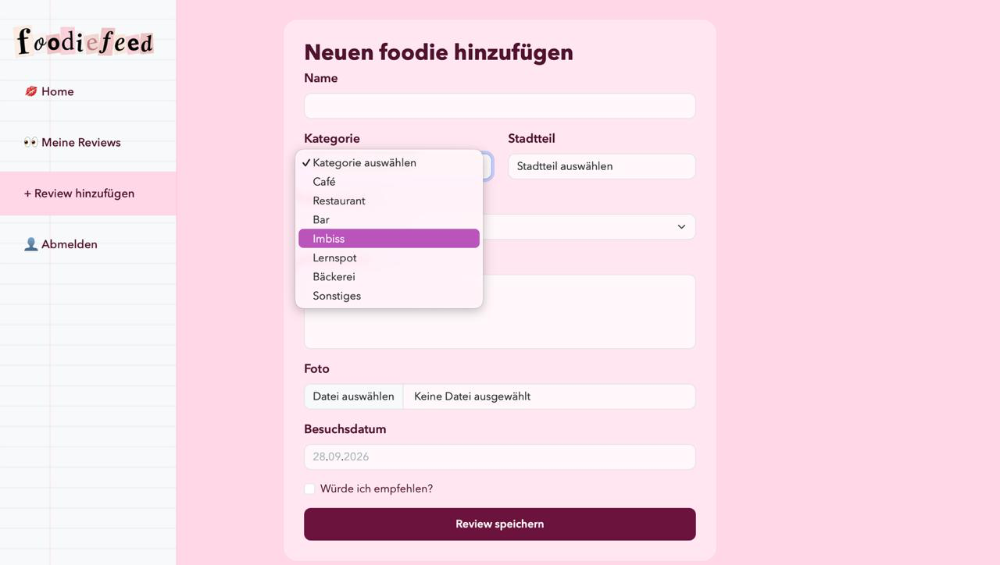
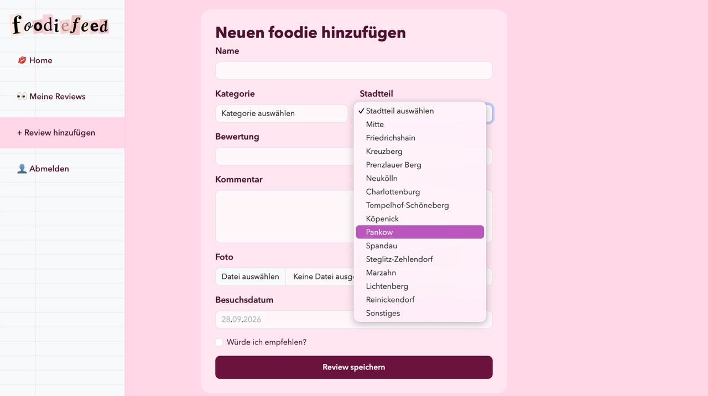
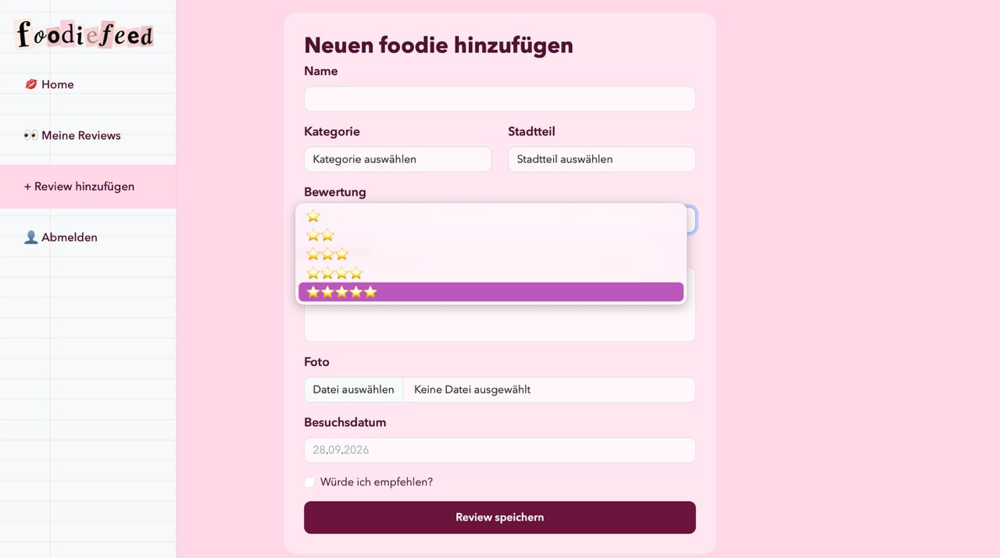
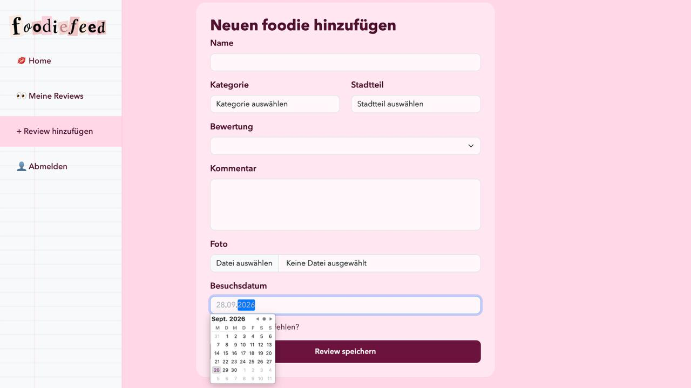
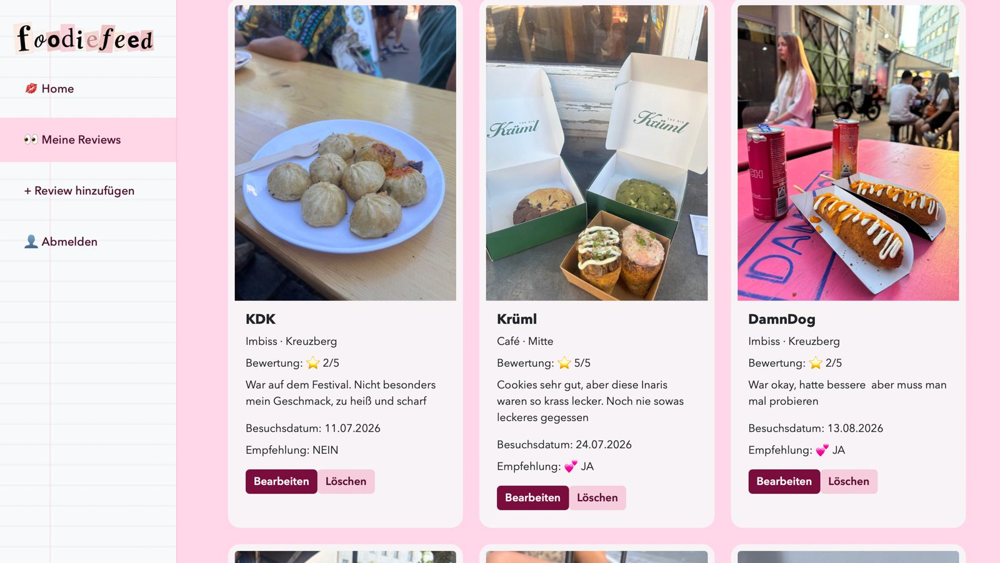
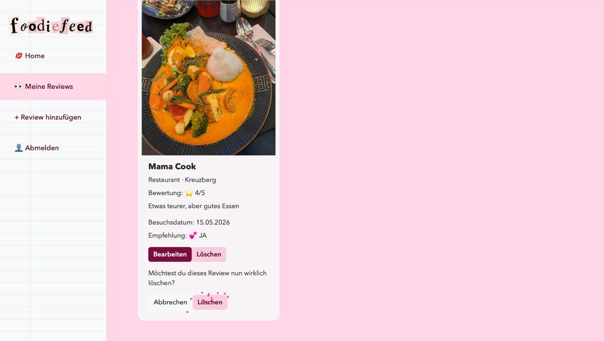
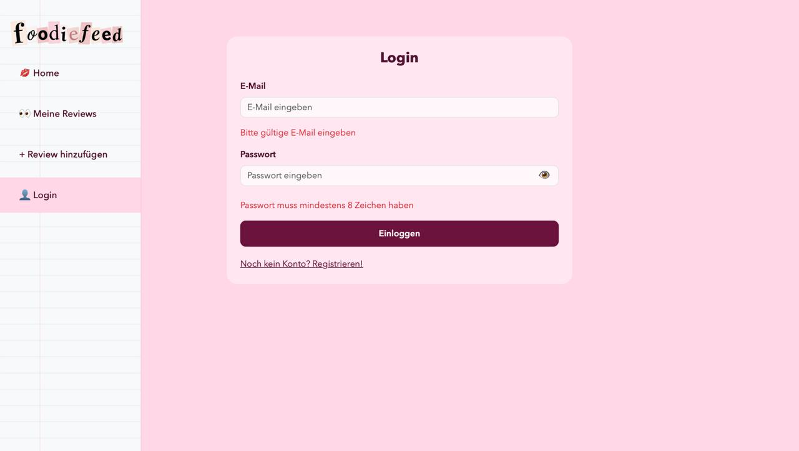
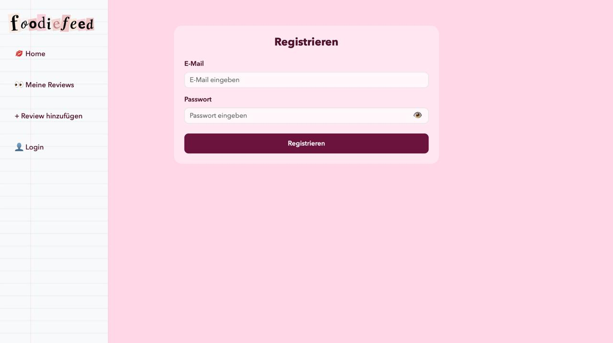

# foodiefeed

Bei foodiefeed handelt es sich um eine persönliche Web-Anwendung, um eigene Food-Spots und Entdeckungen in Berlin festzuhalten, zu speichern und zu verwalten.


## Funktionen

Hier sind die wichtigsten Funktionen der Website im Überblick:

- Reviews erfassen: Du kannst neue Cafés, Restaurants, Lernspots oder Imbisse mit Name, Kategorie, Stadtteil, Bewertung , Kommentaren, Fotos und dem Besuchsdatum abspeichern.

- Empfehlungen markieren: Du kannst angeben, ob du den jeweiligen Food-Spot weiterempfehlen würdest oder nicht.

- Übersicht behalten: Unter „Meine Reviews“ werden alle deine gespeicherten Einträge übersichtlich aufgelistet, inklusive Bearbeiten- und Löschen-Funktion.

## Home-Page:



## Review hinzufügen:







## Meine Reviews:



## Review Löschen/Bearbeiten:



## Login, Fehlermeldung:



## Registrierung:




## Verwendete Technologien

### Frontend

* Angular
* TypeScript
* HTML
* CSS
* Bootstrap

### Backend

* Node.js
* Express

### Datenbank

* PostgreSQL


## Installation

### Voraussetzungen

Um foodiefeed lokal auszuführen, werden folgende Programme benötigt:

* Node.js
* npm
* PostgreSQL

### 1. Projekt herunterladen

Frontend- und Backend-Repository klonen.

### 2. Abhängigkeiten installieren

Im Frontend-Ordner:

```
npm install
```

Im Backend-Ordner:

```
npm install
```

### 3. Datenbank einrichten

PostgreSQL starten und die Datenbank für foodiefeed einrichten.

Die benötigten Datenbank-Zugangsdaten werden im Backend in der `.env`-Datei hinterlegt.

### 4. Backend starten

Im Backend-Ordner:

```
node server.js
```

Das Backend läuft auf Port `3000`.

### 5. Frontend starten

Im Frontend-Ordner:

```
ng serve
```

Anschließend kann foodiefeed im Browser unter `http://localhost:4200` geöffnet werden.


## Verwendung

Bei der Erstellung von foodiefeed kam KI gezielt als technischer und kreativer Assistent zum Einsatz:

- Design & Logo: Für das visuelle Konzept und die Gestaltung des Logos wurde Gemini genutzt. 

- Code & Programmierung: Immer wenn es im Programmierprozess nicht weiterging oder unklar war, wie bestimmte Funktionen umzusetzen sind, half ChatGPT mit Lösungsansätzen weiter. Auch wenn wir Fehler hatten und diese nicht zu lösen wussten, unterstütze uns KI.

-  Fehlersuche (Debugging): Trat ein Fehler im Code auf, wurde ChatGPT verwendet, um das Problem zu analysieren und direkt zu beheben.

Erstellt von Mina Ranjbaryan und Dania Moshtaha